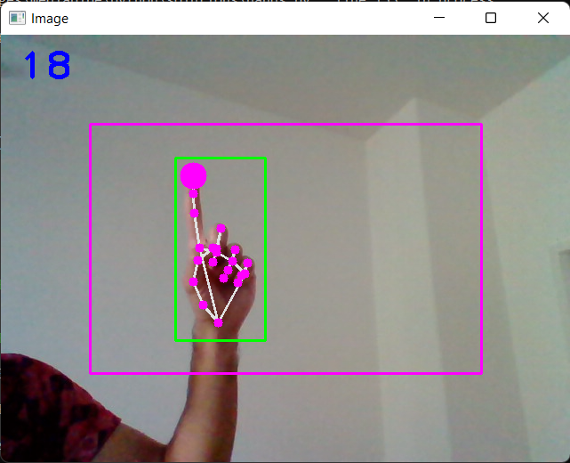
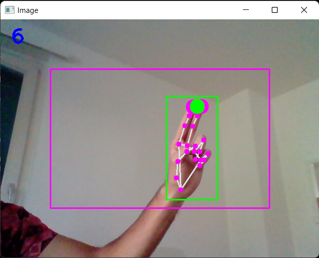

# Hand Tracking Mouse
A simple OpenCV and Mediapipe based hand tracker that acts as a mouse for your computer.

## Installation requirements
The code was tested on Python 3.8.0. Run the following command to install the dependencies.
```bash
pip install -r requirements.txt
```
If autopy installation fails check [autopy website](https://pypi.org/project/autopy/) for other installation options.

## Using the mouse
- Run the `mouse.py` script, which opens the webcam output on your display.
- The purple rectangle corresponds to the screen boundaries which is the finger movement box.
- Keep index finger up and rest closed to move the mouse cursor as shown in figure.
<p align="center">
  
</p>

- Then touch the middle finger to the index to left click at the cursor position. The finger tip turns green to indicate the click as shown.
<p align="center">
  
</p>

- Have fun with the Hand Tracking Mouse.